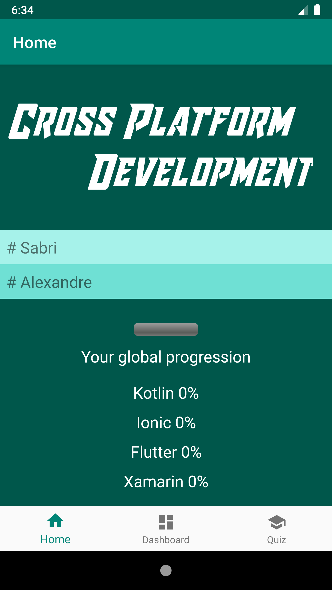
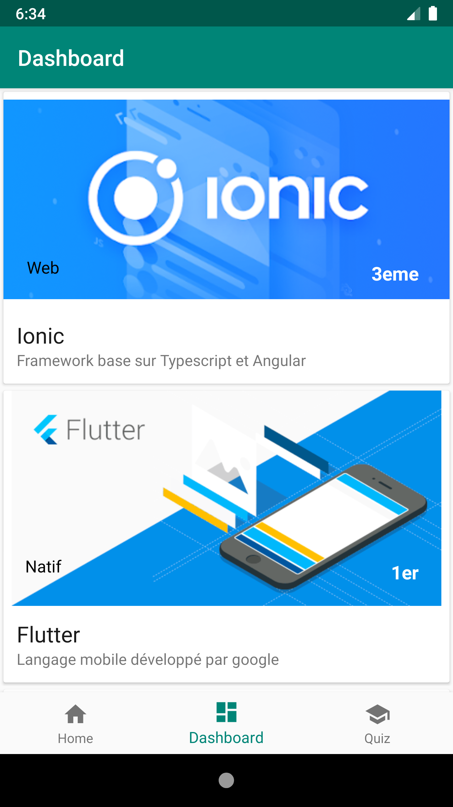
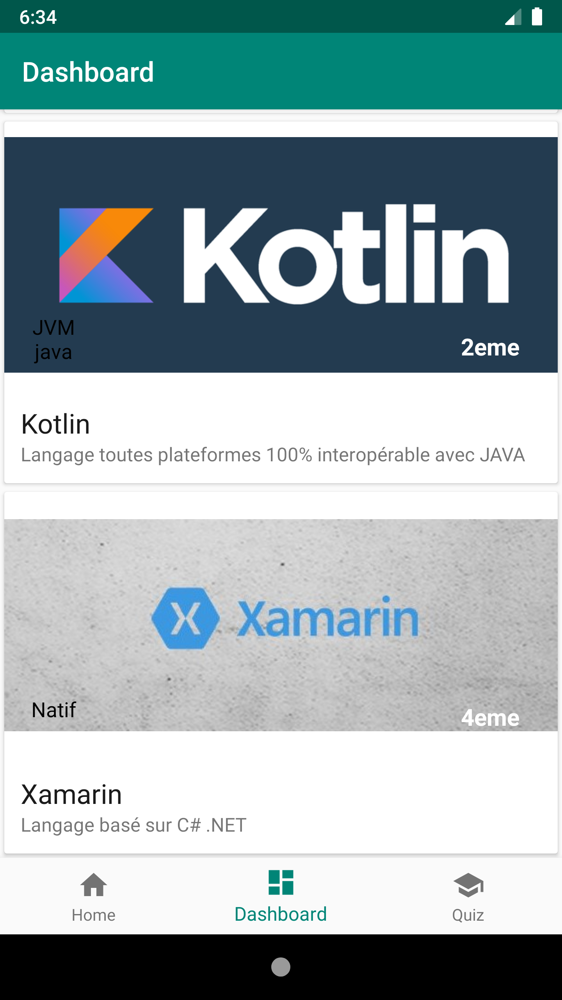
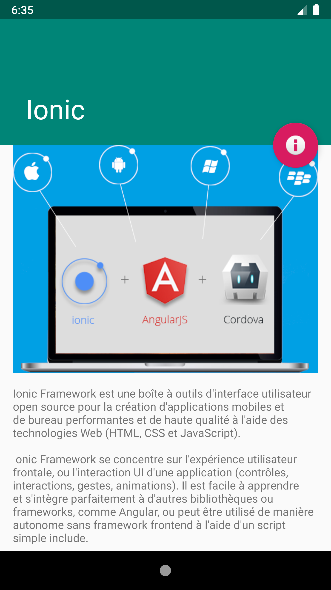
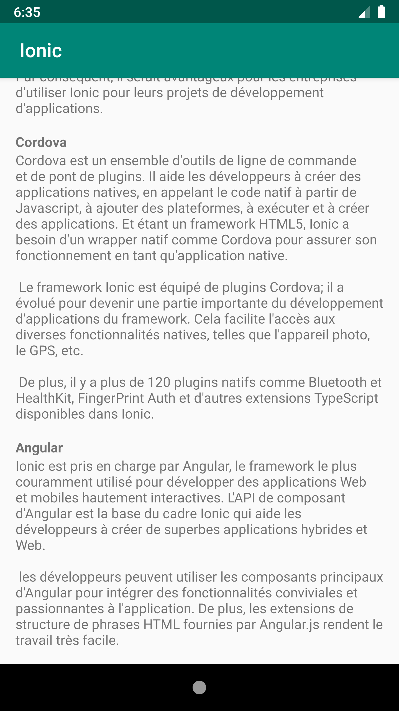
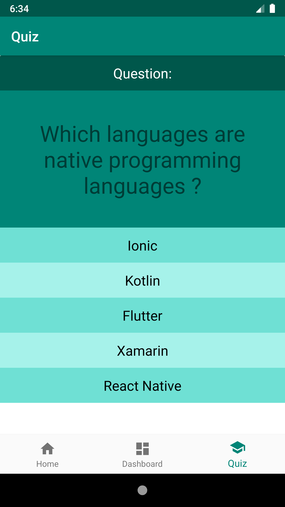
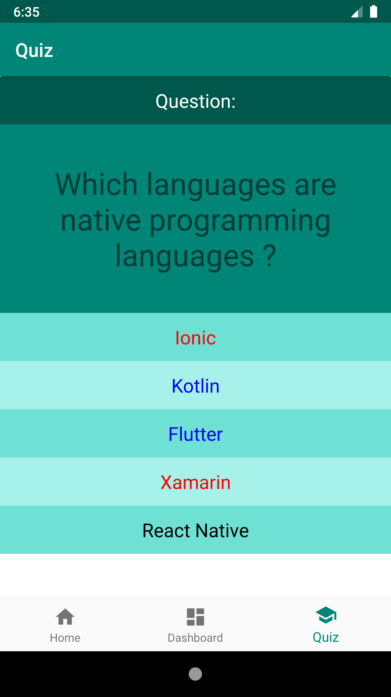

<!-- PROJECT LOGO -->
 

  

  <h3 align="center">Cross Platform Developmengt</h3>

----------
### Auteurs du projet : ###
- Sabri Habib
- Alexandre Armando

----------
### Auteurs du README : ###
- Quentin Hamon
- Martin Lenaerts

----------
### Contexte du projet  ###

Cette application est réalisée dans le cadre de la Licence professionnelle CDTL DAM au sein de l'IUT Nice cote d'azur (2018-2020).

----------
### Résumé du projet  ###

Cette application a pour but de faire découvrir les différents langages cross platform / hybrid.
Elle propose notamment des cours de découverte ainsi que des liens vers les documentations officielles.
Un mini quiz est également présent pour tester ses connaissances.

----------
### Screenshots ###

   
 La page d'accueil présente l'application, le nom des développeurs et l'avancement dans les différents cours. Elle est construite sur un modèle de constraint layout.

 
   
 Le dashboard présente les cours disponibles avec les logos. Il sont présentés par un recycler view chargé depuis un Json.

 
   
 Au click sur un cours une page de détails apparait et propose une initiation à la technologie selectionnée.

  
 Au fur et à mesure que l'on lit les cours proposés, notre progression sur la page d'accueil évolue.

  
 Le 3eme fragment propose un quiz sommaire sur les différentes technologies.

   
 Au clic sur une mauvaise réponse celle-ci devient rouge et une bonne réponse passe en bleu.

----------

### Specifications techniques ###

 Cette application utilise des éléments du matérial design (cards), un parser json, un constraint layout, un recycler view et un menu bottom bar.
